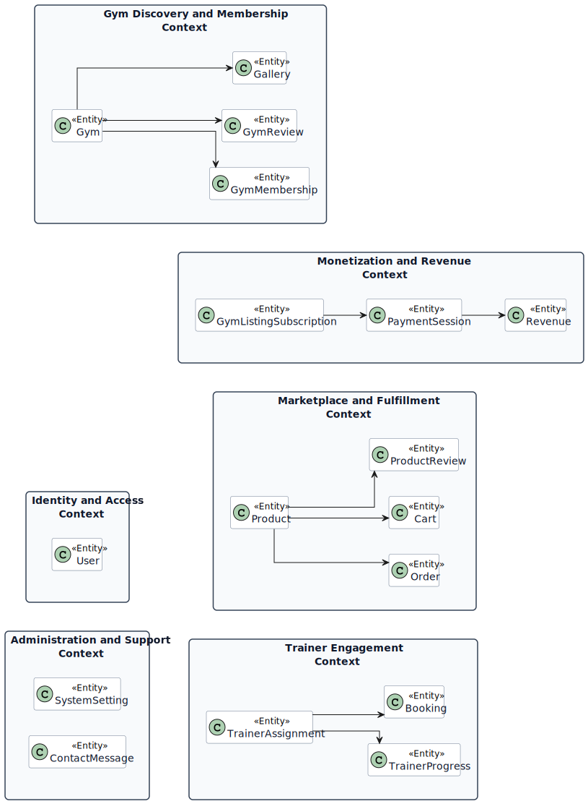
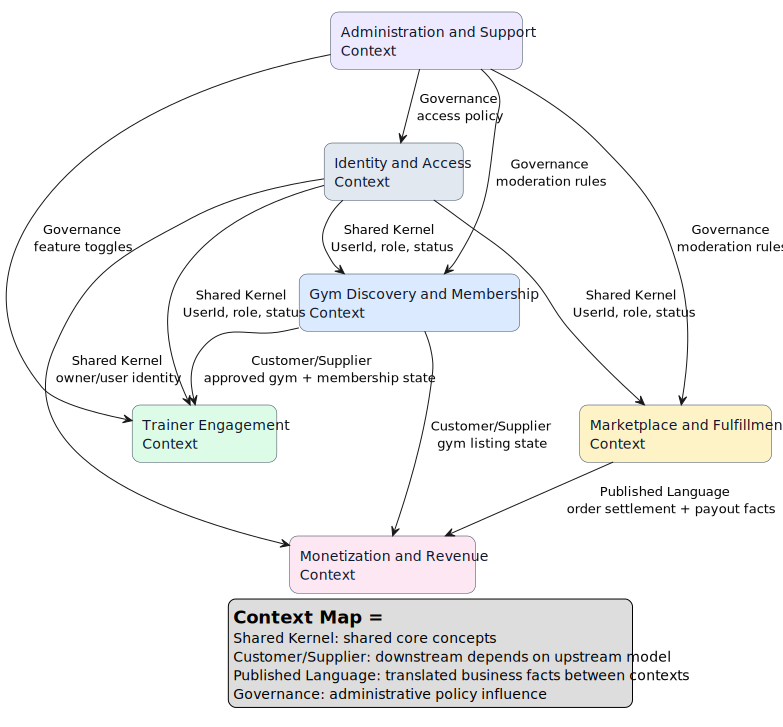
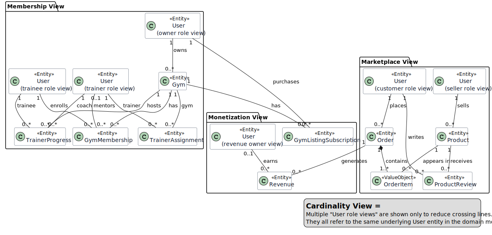
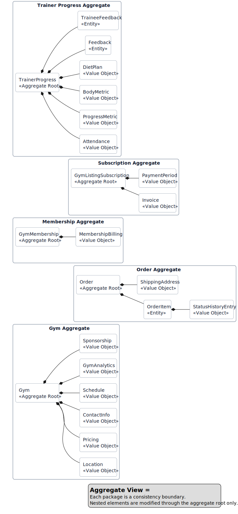

# FitSync: Domain-Driven Design Model

## 1. Project title and brief description

**Title:** FitSync: A Multi-Role Fitness, Gym Membership, and Marketplace Platform

**Brief description:**  
FitSync is a full-stack platform that combines gym discovery, membership management, trainer engagement, and a fitness marketplace into one system. The application supports multiple user roles including trainee, trainer, gym owner, seller, admin, and general user. Trainees can discover gyms, join memberships, review gyms, follow trainer guidance, track progress, and place product orders. Trainers can manage assigned trainees, record attendance, update diet plans, and maintain progress logs. Gym owners can create and manage gym listings, approve trainer requests, monitor memberships, purchase sponsorships, and track business analytics. Sellers can publish products, manage inventory, process customer orders, and monitor fulfillment statuses. Admins supervise the entire platform through moderation, user management, platform settings, and revenue dashboards.  

From a domain perspective, FitSync is not a single model; it is a set of related subdomains that interact through shared references such as `User`, `Gym`, `Order`, and `Revenue`. A Domain-Driven Design approach helps separate concerns into bounded contexts, define aggregate boundaries, and control how models interact. This improves maintainability, aligns the codebase with business capabilities, and makes the system easier to evolve as both B2C and B2B use cases grow.

---

## 2. Bounded contexts

### Bounded contexts identified

1. **Identity and Access Context**
   Handles user identity, role assignment, authentication, profile data, and access control.

2. **Gym Discovery and Membership Context**
   Handles gym listings, public gym search, memberships, gallery items, and gym reviews.

3. **Trainer Engagement Context**
   Handles trainer-to-gym assignment, trainee coaching, attendance, progress tracking, diet plans, feedback, and session booking.

4. **Marketplace and Fulfillment Context**
   Handles products, cart state, order placement, seller inventory, order item fulfillment, and product reviews.

5. **Monetization and Revenue Context**
   Handles listing subscriptions, sponsorship payments, payment sessions, and revenue recording.

6. **Administration and Support Context**
   Handles platform settings, moderation toggles, support/contact messages, and supervisory controls.

### 2.a Bounded context diagram

---

## 3. Context mappings

### 3.b Context map diagram

### Mapping interpretation

| Upstream Context | Downstream Context | Mapping Type | Reason |
| --- | --- | --- | --- |
| Identity and Access | All other contexts | Shared Kernel | All major contexts rely on `User` identity, role, and status. |
| Gym Discovery and Membership | Trainer Engagement | Customer/Supplier | Trainer workflows only make sense if a trainer is approved for a gym and trainees are members of that gym. |
| Gym Discovery and Membership | Monetization and Revenue | Customer/Supplier | Listing subscriptions and sponsorships target gyms and owners. |
| Marketplace and Fulfillment | Monetization and Revenue | Published Language | Revenue is derived from order settlement and marketplace events. |
| Administration and Support | All operational contexts | Partnership / Governance | Admin toggles and moderation policies influence platform behavior globally. |

---

## 4. Submodels: entities, value objects, and services

### 4.c Submodel inventory

| Submodel / Bounded Context | Entities | Value Objects | Services |
| --- | --- | --- | --- |
| Identity and Access | `User` | `Profile`, `SocialLinks`, `OwnerMetrics`, `TraineeMetrics`, `TrainerMetrics`, `PersonalName` | `AuthenticationService`, `ProfileService`, `AccessControlService` |
| Gym Discovery and Membership | `Gym`, `GymMembership`, `Review`, `Gallery` | `Location`, `Pricing`, `ContactInfo`, `Schedule`, `GymAnalytics`, `Sponsorship`, `MembershipBilling` | `GymCatalogueService`, `MembershipService`, `GymReviewService`, `GalleryService` |
| Trainer Engagement | `TrainerAssignment`, `TrainerProgress`, `Booking` | `TraineeRecord`, `Attendance`, `ProgressMetric`, `BodyMetric`, `DietPlan`, `DietMeal`, `Feedback`, `TraineeFeedback`, `SessionFeedback`, `TimeSlot` | `TrainerAssignmentService`, `AttendanceService`, `ProgressTrackingService`, `DietPlanningService`, `BookingService` |
| Marketplace and Fulfillment | `Product`, `Order`, `Cart`, `ProductReview` | `OrderItem`, `ShippingAddress`, `StatusHistoryEntry`, `CartItem`, `Money`, `ProductMetadata` | `CatalogueSearchService`, `OrderPlacementService`, `SellerFulfillmentService`, `ProductReviewService`, `DiscountPricingService` |
| Monetization and Revenue | `GymListingSubscription`, `PaymentSession`, `Revenue` | `Invoice`, `PaymentPeriod`, `OrderSnapshot`, `StripeSessionInfo`, `RevenueMetadata` | `SubscriptionCheckoutService`, `SponsorshipPurchaseService`, `RevenueService`, `PaymentSessionService` |
| Administration and Support | `SystemSetting`, `ContactMessage` | `FeatureToggleSet`, `ContactStatus` | `SystemSettingsService`, `ModerationService`, `SupportInboxService` |

### Notes on classification

- **Entities** have identity and lifecycle over time.
- **Value objects** are immutable conceptual parts inside aggregates or entities.
- **Services** represent business operations that do not fit naturally inside a single entity.

---

## 5. Cardinality ratios

### 4.d Cardinality table

| Relationship | Cardinality Ratio | Explanation |
| --- | --- | --- |
| `User (gym-owner)` to `Gym` | `1 : N` | One owner can own many gyms; each gym has exactly one owner. |
| `Gym` to `GymMembership` | `1 : N` | One gym can have many memberships over time; each membership belongs to one gym. |
| `User (trainee)` to `GymMembership` | `1 : N` | One trainee can have many memberships over time; each membership belongs to one trainee. |
| `User (trainer)` to `GymMembership` | `1 : N` | One trainer can supervise many memberships; a membership references zero or one trainer. |
| `User (trainer)` to `TrainerAssignment` | `1 : N` | One trainer can be assigned to many gyms; one assignment belongs to one trainer. |
| `Gym` to `TrainerAssignment` | `1 : N` | One gym can approve many trainer assignments; one assignment belongs to one gym. |
| `TrainerAssignment` to `TraineeRecord` | `1 : N` | One assignment contains many trainee records; each trainee record belongs to one assignment. |
| `User (trainer)` to `TrainerProgress` | `1 : N` | One trainer tracks many trainee progress records; each progress record belongs to one trainer. |
| `User (trainee)` to `TrainerProgress` | `1 : N` | One trainee can have progress records with one or more trainers; each progress record belongs to one trainee. |
| `Gym` to `TrainerProgress` | `1 : N` | One gym can host many progress records; each progress record belongs to one gym. |
| `User` to `Review` | `1 : N` | One user can review many gyms; each gym review belongs to one user. |
| `Gym` to `Review` | `1 : N` | One gym can receive many reviews; each review belongs to one gym. |
| `User (seller)` to `Product` | `1 : N` | One seller can create many products; each product belongs to one seller. |
| `User` to `Order` | `1 : N` | One customer can place many orders; each order belongs to one customer. |
| `Order` to `OrderItem` | `1 : N` | One order contains one or more order items. |
| `Product` to `OrderItem` | `1 : N` | One product can appear in many order items over time. |
| `Product` to `ProductReview` | `1 : N` | One product can have many reviews; each product review belongs to one product. |
| `User` to `ProductReview` | `1 : N` | One user can review many products; each product review belongs to one user. |
| `Gym` to `GymListingSubscription` | `1 : N` | One gym can have multiple listing subscriptions over time; each subscription belongs to one gym. |
| `User (owner)` to `GymListingSubscription` | `1 : N` | One owner can purchase many subscriptions; each subscription belongs to one owner. |
| `Order` to `Revenue` | `1 : N` | One order can generate multiple revenue records such as seller payout and platform commission. |
| `User` to `Revenue` | `1 : N` | One user can accumulate many revenue entries; each revenue entry belongs to zero or one user. |
| `User` to `ContactMessage` | `0 : N` (conceptual) | A visitor or user can submit many contact messages; current model stores message identity by email, not FK. |

### High-level ER diagram

---

## 6. Aggregates

### 4.e Aggregate definitions

| Bounded Context | Aggregate Root | Members inside the Aggregate | Main Invariants |
| --- | --- | --- | --- |
| Identity and Access | `User` | `Profile`, `SocialLinks`, role-specific metrics, profile picture, refresh token | A user has one identity, one role, one status, and unique email. |
| Gym Discovery and Membership | `Gym` | `Location`, `Pricing`, `ContactInfo`, `Schedule`, `GymAnalytics`, `Sponsorship` | A gym must have one owner, one primary identity, and valid publication/status state. |
| Gym Discovery and Membership | `GymMembership` | `MembershipBilling`, benefits, notes | A membership links one trainee to one gym for a bounded period and valid status. |
| Gym Discovery and Membership | `Review` | rating, comment | A user can review the same gym at most once. |
| Gym Discovery and Membership | `Gallery` | title, description, image metadata | A gallery item belongs to one uploader and optionally one gym. |
| Trainer Engagement | `TrainerAssignment` | `TraineeRecord[]`, request dates, status | A trainer can have only one assignment record per gym. |
| Trainer Engagement | `TrainerProgress` | `Attendance[]`, `ProgressMetric[]`, `BodyMetric[]`, `DietPlan[]`, `Feedback[]`, `TraineeFeedback[]` | One progress aggregate tracks one trainer-trainee coaching relationship. |
| Trainer Engagement | `Booking` | session feedback, payment status, time slot | A booking belongs to one user, one trainer, and one gym. |
| Marketplace and Fulfillment | `Product` | core product data, metadata | A product belongs to one seller and has one current price/stock state. |
| Marketplace and Fulfillment | `Order` | `OrderItem[]`, `ShippingAddress`, order total, status | An order owns its item snapshot and fulfillment history. |
| Marketplace and Fulfillment | `Cart` | `CartItem[]`, total | A cart belongs to one user and contains selected items before checkout. |
| Marketplace and Fulfillment | `ProductReview` | rating, title, comment, verified purchase flag | A user can review the same product at most once. |
| Monetization and Revenue | `GymListingSubscription` | `Invoice[]`, period, metadata | A listing subscription has one target gym, one owner, and one active lifecycle state. |
| Monetization and Revenue | `PaymentSession` | `OrderSnapshot`, `PaymentPeriod`, stripe info, metadata | A payment session tracks one monetization transaction from initiation to completion. |
| Monetization and Revenue | `Revenue` | amount, type, metadata | Revenue entries are immutable business facts once recorded. |
| Administration and Support | `SystemSetting` | key, value, description | One setting key maps to one current platform value. |
| Administration and Support | `ContactMessage` | sender details, message body, status | A support message moves through `new -> read -> responded`. |

### Aggregate diagram

---

## 7. Summary

FitSync is best modeled as a modular monolith with six bounded contexts. The strongest aggregate roots are `User`, `Gym`, `GymMembership`, `TrainerAssignment`, `TrainerProgress`, `Product`, `Order`, `GymListingSubscription`, `Revenue`, `SystemSetting`, and `ContactMessage`. The most important integration paths are:

- **Identity -> all other contexts**
- **Gym Discovery and Membership -> Trainer Engagement**
- **Gym Discovery and Membership -> Monetization**
- **Marketplace -> Monetization**
- **Administration -> platform-wide governance**

This DDD structure matches the current codebase and also provides a clean path for future separation into services if the platform grows.
